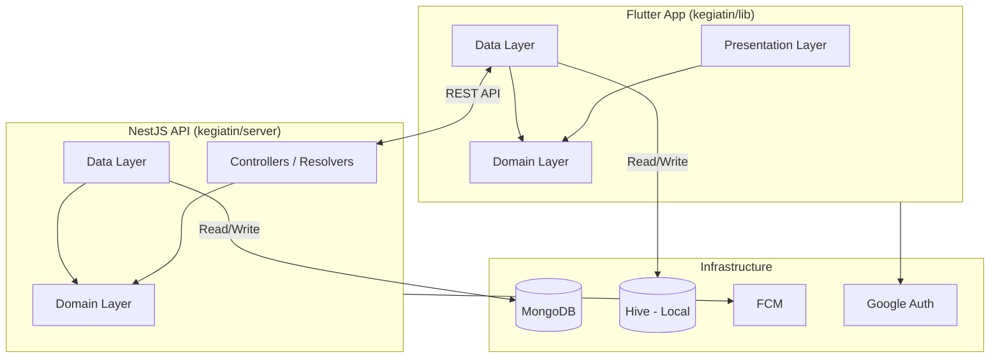
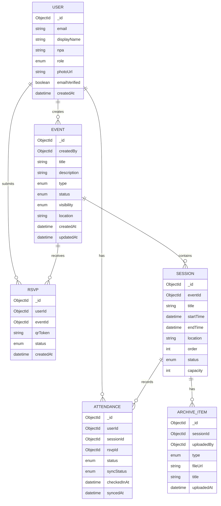
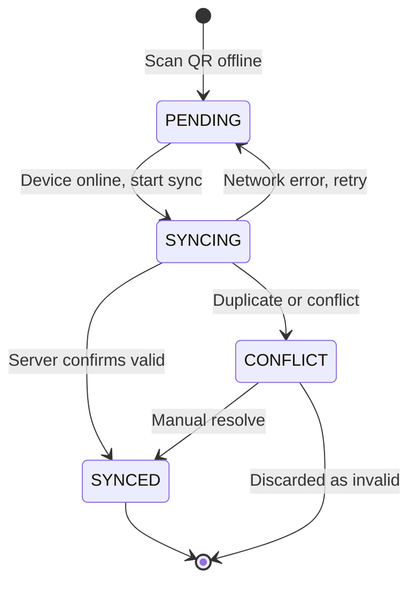

# Arsitektur Sistem - Kegiatin

> Aplikasi Manajemen Kegiatan PD Pemuda Persis Kab. Bandung
> Kelompok C6 | Proyek 4

## 1. Gambaran Umum Arsitektur

Sistem terdiri dari dua komponen utama dalam satu monorepo:

```
kegiatin/
  lib/              # Flutter App (Mobile Client)
  server/           # NestJS API (Backend)
```

Prinsip arsitektur yang dianut: **Clean Architecture** - pemisahan tanggung jawab berlapis di kedua sisi, dengan **Domain** sebagai inti yang tidak bergantung pada framework atau infrastruktur.



### Dependency Rule

Panah dependensi hanya boleh mengarah ke dalam (menuju Domain):

```
presentation/ --> domain/ <-- data/
   (outer)       (core)     (outer)
```

- **domain/** tidak boleh mengimpor apapun dari `presentation/` atau `data/`
- **domain/** ditulis dalam pure Dart/TypeScript tanpa dependensi framework
- **data/** mengimplementasikan interface (contract) yang didefinisikan di `domain/repositories/`
- **presentation/** hanya mengimpor dari `domain/`, tidak langsung dari `data/`
- **core/** boleh diimpor oleh semua layer (constants, errors, extensions, theme)

Pendekatan **layer-first** (bukan feature-first) dipilih karena:
- Menghindari masalah cross-feature dependency
- Semua entity berada di satu tempat (`domain/entities/`), mudah ditemukan dan diimpor
- Struktur lebih flat, navigasi lebih cepat untuk proyek skala ini

---

## 2. Flutter App - Clean Architecture

### 2.1 Struktur Direktori

```
lib/
  main.dart                              # Entry point, ProviderScope, MaterialApp.router

  core/
    constants/
      api_constants.dart                 # Base URL, timeout values
      db_constants.dart                  # Hive box names
    errors/
      failures.dart                      # Failure classes (sealed: Server, Cache, Network, Auth)
      exceptions.dart                    # Custom exceptions
    extensions/
      context_extensions.dart
      datetime_extensions.dart
    network/
      network_info.dart                  # Connectivity checker
    theme/
      material_theme.dart                # Generated from Material Theme Builder
      app_theme.dart                     # ThemeData assembly + ThemeExtension tokens
      util.dart                          # createTextTheme()
    utils/
      qr_utils.dart
      sync_status.dart                   # Enum: PENDING, SYNCING, SYNCED, CONFLICT

  domain/
    entities/
      user.dart
      event.dart
      session.dart
      attendance.dart
      rsvp.dart
      archive_item.dart
      member_profile.dart
      activity_record.dart
    enums/
      user_role.dart                     # ADMIN, MEMBER
      event_type.dart                    # SINGLE, SERIES
      event_status.dart                  # DRAFT, PUBLISHED, ONGOING, COMPLETED, CANCELLED
      event_visibility.dart              # OPEN, INVITE_ONLY
      session_status.dart                # SCHEDULED, ONGOING, COMPLETED, POSTPONED
      rsvp_status.dart                   # CONFIRMED, CANCELLED, WAITLIST
      attendance_status.dart             # PRESENT, LATE, ABSENT
      sync_status.dart                   # PENDING, SYNCING, SYNCED, CONFLICT
      archive_type.dart                  # MATERIAL, PHOTO, EVALUATION
    repositories/
      auth_repository.dart               # Abstract class (interface)
      event_repository.dart
      session_repository.dart
      attendance_repository.dart
      archive_repository.dart
      profile_repository.dart
    usecases/
      # Auth
      login_usecase.dart
      register_usecase.dart
      verify_email_usecase.dart
      # Events
      get_events_usecase.dart
      create_event_usecase.dart
      update_event_usecase.dart
      publish_event_usecase.dart
      # Sessions
      add_session_usecase.dart
      update_session_usecase.dart
      delete_session_usecase.dart
      # Attendance
      scan_qr_usecase.dart
      record_attendance_usecase.dart
      sync_attendance_usecase.dart
      get_attendance_history_usecase.dart
      # Archive
      upload_material_usecase.dart
      get_materials_usecase.dart
      # Profile
      get_profile_usecase.dart
      get_activity_history_usecase.dart

  data/
    models/
      user_model.dart                    # freezed + json_serializable
      auth_response_model.dart
      event_model.dart
      session_model.dart
      attendance_model.dart              # Includes syncStatus field
      rsvp_model.dart
      archive_model.dart
      profile_model.dart
      activity_record_model.dart
    datasources/
      auth_remote_datasource.dart
      auth_local_datasource.dart         # Hive box
      event_remote_datasource.dart
      event_local_datasource.dart
      session_remote_datasource.dart
      session_local_datasource.dart
      attendance_remote_datasource.dart
      attendance_local_datasource.dart
      archive_remote_datasource.dart
      profile_remote_datasource.dart
      profile_local_datasource.dart
    repositories/
      auth_repository_impl.dart          # Implements domain/repositories/auth_repository.dart
      event_repository_impl.dart
      session_repository_impl.dart
      attendance_repository_impl.dart
      archive_repository_impl.dart
      profile_repository_impl.dart

  presentation/
    pages/
      login_page.dart
      register_page.dart
      event_list_page.dart
      event_detail_page.dart
      event_form_page.dart               # Create/Edit
      session_manage_page.dart
      qr_scan_page.dart                  # Admin: scan QR
      qr_display_page.dart               # Peserta: show QR
      archive_page.dart
      material_viewer_page.dart
      profile_page.dart
      activity_history_page.dart
    widgets/
      login_form.dart
      npa_input_field.dart
      event_card.dart
      session_timeline.dart
      visibility_selector.dart
      qr_scanner_view.dart
      attendance_status_chip.dart
    controllers/
      auth_controller.dart               # Riverpod AsyncNotifierProvider
      event_list_controller.dart
      event_detail_controller.dart
      event_form_controller.dart
      session_controller.dart
      scan_controller.dart
      attendance_controller.dart
      archive_controller.dart
      profile_controller.dart
```

### 2.2 Penjelasan Layer

#### Presentation Layer (`presentation/`)

- **Pages**: Full-screen widgets (setara View)
- **Widgets**: Reusable UI components
- **Controllers**: Riverpod providers yang memanggil Use Cases, mengelola state
- Hanya mengimpor dari `domain/` dan `core/`, tidak dari `data/`

```dart
// Contoh: event_list_controller.dart
@riverpod
class EventList extends _$EventList {
  @override
  Future<List<Event>> build() {
    return ref.read(getEventsProvider).call();
  }

  Future<void> refresh() async {
    ref.invalidateSelf();
  }
}
```

#### Domain Layer (`domain/`)

- **Entities**: Objek bisnis murni, tanpa dependensi framework
- **Enums**: Enum yang dipakai lintas fitur (UserRole, EventType, SyncStatus, dll)
- **Repositories (abstract)**: Interface/contract yang diimplementasi `data/repositories/`
- **Use Cases**: Satu use case = satu aksi bisnis. Menerima Repository via constructor injection
- Tidak mengimpor dari `presentation/` atau `data/`

```dart
// Contoh: get_events_usecase.dart
class GetEventsUseCase {
  final EventRepository repository;
  GetEventsUseCase(this.repository);

  Future<List<Event>> call() => repository.getEvents();
}
```

#### Data Layer (`data/`)

- **Models**: Extend/combine Entity + JSON/Hive serialization (freezed + json_serializable)
- **DataSources**: Remote (API calls) dan Local (Hive CRUD)
- **Repository Impl**: Mengimplementasikan Repository dari `domain/repositories/`. Memutuskan sumber data mana yang dipakai (offline-first logic)
- Mengimpor dari `domain/` (entities, repository interfaces) dan `core/`

```dart
// Contoh: event_repository_impl.dart
class EventRepositoryImpl implements EventRepository {
  final EventRemoteDataSource remote;
  final EventLocalDataSource local;
  final NetworkInfo networkInfo;

  @override
  Future<List<Event>> getEvents() async {
    if (await networkInfo.isConnected) {
      final models = await remote.getEvents();
      await local.cacheEvents(models);
      return models.map((m) => m.toEntity()).toList();
    }
    final models = await local.getCachedEvents();
    return models.map((m) => m.toEntity()).toList();
  }
}
```

### 2.3 Offline-First Strategy

Empat area offline yang diimplementasikan (sesuai flowchart-sistem.md):

| Area                | Local Source          | Sync Direction   | Conflict Resolution                   |
| ------------------- | --------------------- | ---------------- | ------------------------------------- |
| Local Cache Peserta | Hive (rsvp box)       | Server -> Client | Server wins                           |
| Presensi QR         | Hive (attendance box) | Client -> Server | Pending validation, resolve saat sync |
| History/Riwayat     | Hive (history box)    | Server -> Client | Server wins, merge local              |
| QR RSVP Peserta     | Hive (rsvp box)       | Server -> Client | Local tersedia tanpa network          |

Alur sync attendance:

```dart
// Saat online, background sync
Future<void> syncPendingAttendance() async {
  final pending = await local.getPendingAttendance();
  for (final record in pending) {
    try {
      await remote.syncAttendance(record);
      await local.updateSyncStatus(record.id, SyncStatus.synced);
    } on ConflictException {
      await local.updateSyncStatus(record.id, SyncStatus.conflict);
    } on InvalidQRException {
      await local.markAsNoShow(record.id);
    }
  }
}
```

---

## 3. NestJS Server - Modular Architecture

### 3.1 Struktur Direktori

```
server/
  src/
    main.ts                          # Bootstrap, NestFactory.create

    app.module.ts                     # Root module

    core/
      constants/
        env.constants.ts
      decorators/
        roles.decorator.ts           # @Roles('admin')
      filters/
        http-exception.filter.ts
      guards/
        jwt-auth.guard.ts
        roles.guard.ts
      interceptors/
        transform.interceptor.ts      # Standardize API response
      pipes/
        validation.pipe.ts

    config/
      database.config.ts             # Mongoose connection
      auth.config.ts                 # JWT, Google OAuth, Passport strategies
      app.config.ts                  # Environment variables

    shared/
      dto/
        pagination.dto.ts
      interfaces/
        api-response.interface.ts
      types/
        express.d.ts

    modules/
      auth/
        auth.module.ts
        auth.controller.ts
        auth.service.ts
        dto/
          register.dto.ts
          login.dto.ts
        domain/
          user.types.ts              # Plain TS interface (IUser, IUserProfile)
          auth.repository.ts         # IAuthRepository interface
        repositories/
          auth.repository.impl.ts    # MongooseAuthRepository implements IAuthRepository
        entities/
          user.entity.ts             # Mongoose schema
        strategies/
          jwt.strategy.ts
          google.strategy.ts

      events/
        events.module.ts
        events.controller.ts
        events.service.ts
        dto/
          create-event.dto.ts
          update-event.dto.ts
        domain/
          event.types.ts             # IEvent, ISession, EventStatus enum
          event.rules.ts             # Pure domain rules (canPublish, canCancel)
          event.repository.ts        # IEventRepository interface
        repositories/
          event.repository.impl.ts   # MongooseEventRepository implements IEventRepository
        entities/
          event.entity.ts
          session.entity.ts

      attendance/
        attendance.module.ts
        attendance.controller.ts
        attendance.service.ts
        dto/
          scan-qr.dto.ts
          sync-attendance.dto.ts
        domain/
          attendance.types.ts        # IAttendance, IRsvp, SyncStatus enum
          attendance.rules.ts        # validateQrToken, resolveSyncConflict
          attendance.repository.ts   # IAttendanceRepository interface
        repositories/
          attendance.repository.impl.ts  # MongooseAttendanceRepository
        entities/
          attendance.entity.ts
          rsvp.entity.ts

      archive/
        archive.module.ts
        archive.controller.ts
        archive.service.ts
        dto/
          upload-material.dto.ts
        domain/
          archive.types.ts           # IArchiveItem
          archive.repository.ts      # IArchiveRepository interface
        repositories/
          archive.repository.impl.ts # MongooseArchiveRepository

      profile/
        profile.module.ts
        profile.controller.ts
        profile.service.ts
        domain/
          profile.types.ts           # IUserHistory
          profile.repository.ts      # IProfileRepository interface
        repositories/
          profile.repository.impl.ts # MongooseProfileRepository

      sync/
        sync.module.ts
        sync.controller.ts
        sync.service.ts              # Handle bulk sync from client
        dto/
          sync-attendance-batch.dto.ts
        domain/
          sync.types.ts              # ISyncResult, SyncConflict enum
          sync.repository.ts         # ISyncRepository interface
        repositories/
          sync.repository.impl.ts    # MongooseSyncRepository
```

### 3.2 Penjelasan Layer (NestJS)

NestJS menggunakan modular architecture (module-per-feature). Setiap module memiliki 4 area:

| Area             | Isi                                                                  | Tanggung Jawab                                              |
| ---------------- | -------------------------------------------------------------------- | ----------------------------------------------------------- |
| **Presentation** | Controller + DTO                                                     | Request/response shaping, input validation                  |
| **Domain**       | `domain/*.types.ts` + `domain/*.rules.ts` + `domain/*.repository.ts` | Business rules + Repository interface (pure TS)             |
| **Data**         | Entity (Mongoose schema) + `repositories/*.repository.impl.ts`       | Persistensi, query, data access                             |
| **Service**      | Service (orchestration)                                              | Menggabungkan domain rules + repository, return plain types |

#### Dependency Rule (Server)

```
Controller --> Service --> domain/rules (pure TS)
                   |--> domain/repository (interface)
                   |--> domain/types (return types)

Repository Impl --> Entity/Mongoose (data access)
                |--> domain/types (mapping target)
```

- Controller hanya mengimpor DTO dan Service. Tidak mengimpor Entity atau Repository langsung.
- Service mengimpor **Repository interface** (dari `domain/`), bukan Mongoose Model langsung.
- Service mengembalikan **plain TypeScript interface** (dari `domain/types`), bukan Mongoose Document.
- `domain/rules.ts` berisi fungsi pure tanpa side-effect, bisa di-unit test tanpa mock DB.
- Repository Impl (`repositories/`) mengimplementasikan interface dari `domain/`, mengimpor Entity (Mongoose).
- Jika DB berubah (misal MongoDB ke PostgreSQL), cukup buat Repository Impl baru. Service dan Domain tidak berubah.

#### Contoh: Event Module

**domain/event.types.ts** - Plain TypeScript interface, tidak terikat Mongoose:

```typescript
export enum EventStatus {
  DRAFT = 'DRAFT',
  PUBLISHED = 'PUBLISHED',
  ONGOING = 'ONGOING',
  COMPLETED = 'COMPLETED',
  CANCELLED = 'CANCELLED',
}

export interface IEvent {
  id: string;
  title: string;
  description: string;
  type: 'single' | 'series';
  status: EventStatus;
  createdBy: string;
  sessions: ISession[];
  createdAt: Date;
  updatedAt: Date;
}

export interface ISession {
  id: string;
  title: string;
  startTime: Date;
  endTime: Date;
}
```

**domain/event.rules.ts** - Pure business rules, tanpa DB dependency:

```typescript
import { EventStatus, IEvent } from './event.types';

export function canPublish(event: IEvent): { ok: boolean; reason?: string } {
  if (event.status !== EventStatus.DRAFT) {
    return { ok: false, reason: 'Only draft events can be published' };
  }
  if (event.sessions.length === 0) {
    return { ok: false, reason: 'Event must have at least one session' };
  }
  return { ok: true };
}

export function canCancel(event: IEvent): { ok: boolean; reason?: string } {
  if (event.status === EventStatus.COMPLETED || event.status === EventStatus.CANCELLED) {
    return { ok: false, reason: 'Completed or cancelled events cannot be cancelled' };
  }
  return { ok: true };
}
```

**domain/event.repository.ts** - Repository interface, tidak terikat implementasi DB:

```typescript
import { IEvent } from './event.types';

export abstract class IEventRepository {
  abstract findById(id: string): Promise<IEvent | null>;
  abstract findAll(filter?: Partial<IEvent>): Promise<IEvent[]>;
  abstract create(data: Omit<IEvent, 'id' | 'createdAt' | 'updatedAt'>): Promise<IEvent>;
  abstract update(id: string, data: Partial<IEvent>): Promise<IEvent>;
  abstract delete(id: string): Promise<void>;
}
```

**repositories/event.repository.impl.ts** - Mongoose implementation, mengimpor Entity:

```typescript
import { Injectable } from '@nestjs/common';
import { InjectModel } from '@nestjs/mongoose';
import { Model } from 'mongoose';
import { IEventRepository } from '../domain/event.repository';
import { IEvent } from '../domain/event.types';
import { Event, EventDocument } from '../entities/event.entity';

@Injectable()
export class MongooseEventRepository extends IEventRepository {
  constructor(
    @InjectModel(Event.name) private eventModel: Model<EventDocument>,
  ) {
    super();
  }

  async findById(id: string): Promise<IEvent | null> {
    const doc = await this.eventModel.findById(id).populate('sessions');
    return doc ? this.toDomain(doc) : null;
  }

  async findAll(filter?: Partial<IEvent>): Promise<IEvent[]> {
    const docs = await this.eventModel.find(filter);
    return docs.map((d) => this.toDomain(d));
  }

  async create(data: Omit<IEvent, 'id' | 'createdAt' | 'updatedAt'>): Promise<IEvent> {
    const doc = await this.eventModel.create(data);
    return this.toDomain(doc);
  }

  async update(id: string, data: Partial<IEvent>): Promise<IEvent> {
    const doc = await this.eventModel.findByIdAndUpdate(id, data, { new: true });
    return this.toDomain(doc);
  }

  async delete(id: string): Promise<void> {
    await this.eventModel.findByIdAndDelete(id);
  }

  private toDomain(doc: EventDocument): IEvent {
    return {
      id: doc._id.toHexString(),
      title: doc.title,
      description: doc.description,
      type: doc.type,
      status: doc.status,
      createdBy: doc.createdBy.toHexString(),
      sessions: doc.sessions.map((s) => ({
        id: s._id.toHexString(),
        title: s.title,
        startTime: s.startTime,
        endTime: s.endTime,
      })),
      createdAt: doc.createdAt,
      updatedAt: doc.updatedAt,
    };
  }
}
```

**events.service.ts** - Service inject Repository interface, bukan Mongoose Model:

```typescript
import { canPublish } from './domain/event.rules';
import { IEvent } from './domain/event.types';
import { IEventRepository } from './domain/event.repository';

@Injectable()
export class EventsService {
  constructor(private readonly eventRepo: IEventRepository) {}

  async publishEvent(id: string, userId: string): Promise<IEvent> {
    const event = await this.eventRepo.findById(id);
    if (!event) throw new NotFoundException();
    if (event.createdBy !== userId) throw new ForbiddenException();

    // Domain rule via pure function
    const check = canPublish(event);
    if (!check.ok) throw new BadRequestException(check.reason);

    return this.eventRepo.update(id, { status: EventStatus.PUBLISHED });
  }
}
```

**events.module.ts** - Binding interface ke implementation:

```typescript
import { IEventRepository } from './domain/event.repository';
import { MongooseEventRepository } from './repositories/event.repository.impl';

@Module({
  imports: [MongooseModule.forFeature([Event, Session])],
  controllers: [EventsController],
  providers: [
    { provide: IEventRepository, useClass: MongooseEventRepository },
    EventsService,
  ],
})
export class EventsModule {}
```

#### Mengapa tidak full Clean Architecture (Use Case layer)?

- Repository interface **sudah ditambahkan** untuk melindungi Service dari perubahan DB. Jika MongoDB berubah ke PostgreSQL, cukup buat `PostgresEventRepository` baru, Service dan Domain tidak berubah.
- Use Case layer **tidak ditambahkan** karena Service sudah tipis (hanya orchestrate repo + domain rules). Menambah Use Case per aksi = duplikasi logic tanpa benefit signifikan untuk kompleksitas proyek ini.
- `domain/rules.ts` sudah memisahkan business logic, bisa di-unit test tanpa mock DB.
- Service bisa di-test dengan mock `IEventRepository` (interface), tanpa perlu mock Mongoose Model.
- Total file tambahan per module: 2 (interface + impl). Ini trade-off yang seimbang untuk portabilitas DB.

### 3.3 API Contract Overview

> Detail lengkap (request/response schema, status codes, query params): lihat `.docs/openapi.yaml`

| Method | Endpoint                | Auth   | Deskripsi                            |
| ------ | ----------------------- | ------ | ------------------------------------ |
| POST   | `/auth/register`        | Public | Registrasi user                      |
| POST   | `/auth/login`           | Public | Login email/password                 |
| POST   | `/auth/google`          | Public | Login via Google OAuth               |
| GET    | `/auth/verify-email`    | Public | Verifikasi email token               |
| GET    | `/events`               | User   | List events (filter by status, type) |
| POST   | `/events`               | Admin  | Create event                         |
| PATCH  | `/events/:id`           | Admin  | Update event                         |
| PATCH  | `/events/:id/publish`   | Admin  | Publish event                        |
| DELETE | `/events/:id`           | Admin  | Delete draft event                   |
| GET    | `/events/:id`           | User   | Event detail + sessions              |
| POST   | `/events/:id/sessions`  | Admin  | Add session to event                 |
| PATCH  | `/sessions/:id`         | Admin  | Update session                       |
| DELETE | `/sessions/:id`         | Admin  | Delete session                       |
| POST   | `/events/:id/rsvp`      | User   | RSVP ke event                        |
| GET    | `/events/:id/attendees` | Admin  | List RSVP peserta (for local cache)  |
| GET    | `/rsvp/:id/qr`          | User   | Get QR token for RSVP                |
| POST   | `/attendance/scan`      | Admin  | Verify & record attendance           |
| POST   | `/attendance/sync`      | Admin  | Bulk sync offline attendance         |
| GET    | `/attendance/history`   | User   | Riwayat kehadiran sendiri            |
| POST   | `/archive/upload`       | Admin  | Upload materi/foto                   |
| GET    | `/archive/:eventId`     | User   | List materi event                    |
| GET    | `/profile/me`           | User   | Profil sendiri                       |
| GET    | `/profile/history`      | User   | Histori kegiatan pribadi             |

---

## 4. Data Model

### 4.1 Entity Relationship



### 4.2 Enum Definitions

| Enum               | Values                                                    | Keterangan                                                      |
| ------------------ | --------------------------------------------------------- | --------------------------------------------------------------- |
| `UserRole`         | `ADMIN`, `MEMBER`                                         | Hak akses aplikasi                                              |
| `EventType`        | `SINGLE`, `SERIES`                                        | Single = 1 sesi eksplisit, Series = multi-sesi                  |
| `EventStatus`      | `DRAFT`, `PUBLISHED`, `ONGOING`, `COMPLETED`, `CANCELLED` | Lifecycle event                                                 |
| `EventVisibility`  | `OPEN`, `INVITE_ONLY`                                     | Open = bebas RSVP, Invite = perlu undangan                      |
| `SessionStatus`    | `SCHEDULED`, `ONGOING`, `COMPLETED`, `POSTPONED`          | Lifecycle sesi. Single Event: 1 sesi otomatis dibuat            |
| `RsvpStatus`       | `CONFIRMED`, `CANCELLED`, `WAITLIST`                      | WAITLIST jika kuota event penuh                                 |
| `AttendanceStatus` | `PRESENT`, `LATE`, `ABSENT`                               | Status kehadiran per sesi. Batas LATE = ketentuan organisasi    |
| `SyncStatus`       | `PENDING`, `SYNCING`, `SYNCED`, `CONFLICT`                | Status sinkronisasi attendance offline                          |
| `ArchiveType`      | `MATERIAL`, `PHOTO`, `EVALUATION`                         | Jenis arsip digital per sesi                                    |

---

## 5. Cross-Cutting Concerns

### 5.1 Authentication Flow

```
Client                              Server
  |                                    |
  |--- POST /auth/login ------------->|
  |<-- { accessToken, refreshToken }--|
  |                                    |
  |--- GET /events -------------------->|  (Header: Bearer <accessToken>)
  |<-- 200 + events -------------------|
  |                                    |
  |--- GET /events (token expired) --->|
  |<-- 401 Unauthorized --------------|
  |                                    |
  |--- POST /auth/refresh ------------>|
  |<-- { accessToken } ---------------|
  |                                    |
  |--- GET /events (retry) ----------->|
  |<-- 200 + events -------------------|
```

- **JWT**: Access token (short-lived, 15min) + Refresh token (7d)
- **Google Auth**: OAuth2 via Passport GoogleStrategy, server exchange code for profile
- **Role Guard**: `@Roles('admin')` decorator + `RolesGuard` memvalidasi role dari JWT payload

### 5.2 Error Handling

**Client side** - Setiap Use Case mengembalikan `Future<Either<Failure, T>>`:

```dart
// Domain: failure.dart
sealed class Failure {
  final String message;
  const Failure(this.message);
}
class ServerFailure extends Failure { ... }
class CacheFailure extends Failure { ... }
class NetworkFailure extends Failure { ... }
class AuthFailure extends Failure { ... }
```

**Server side** - Global exception filter mengkonversi ke standard response:

```typescript
{
  "success": false,
  "statusCode": 404,
  "message": "Event not found",
  "error": "Not Found"
}
```

### 5.3 Sync Status State Machine



### 5.4 Notification (Client-Local)

Notifikasi **tidak disimpan di database server**. Penyimpanan dan pengelolaan notifikasi dilakukan sepenuhnya di sisi client menggunakan Hive (local storage).

**Arsitektur:**
- Notifikasi disimpan di Hive box `notifications` di device pengguna
- Data notifikasi tersedia secara offline
- Read/unread status dikelola di local storage

**Delivery Mechanism (TBD):**

| Opsi | Kelebihan | Kekurangan |
| --- | --- | --- |
| **FCM** | Tidak perlu maintain koneksi, hemat baterai, delivery saat app mati | Bergantung pada Google Play Services, latensi tidak real-time |
| **WebSocket + Queue** | Real-time delivery, tidak bergantung third-party | Perlu maintain koneksi, konsumsi baterai lebih tinggi, kompleksitas server naik |

Keputusan delivery mechanism akan ditentukan setelah evaluasi kebutuhan real-time dari stakeholder.

**Flutter Structure (tambahan):**
```
data/
  models/
    notification_model.dart          # Hive type adapter, local only
  datasources/
    notification_local_datasource.dart  # Hive CRUD untuk notifikasi

domain/
  entities/
    notification.dart                # Entity: id, title, body, type, isRead, createdAt
  enums/
    notification_type.dart           # EVENT_CREATED, SESSION_UPDATED, REMINDER

presentation/
  pages/
    notification_page.dart           # Inbox notifikasi
  controllers/
    notification_controller.dart     # Kelola state notifikasi lokal
```

---

## 6. Tech Stack Summary

| Layer                | Teknologi                                       |
| -------------------- | ----------------------------------------------- |
| **Mobile Framework** | Flutter (Dart)                                  |
| **State Management** | Riverpod                                        |
| **Local Database**   | Hive CE (Community Edition)                     |
| **Server Framework** | NestJS (TypeScript)                             |
| **Server Runtime**   | Node.js                                         |
| **Database**         | MongoDB (Mongoose ODM)                          |
| **Auth**             | Passport.js (JWT + Google OAuth)                |
| **Notifications**    | Client-local (Hive). Delivery: TBD (FCM / WebSocket) |
| **QR**               | mobile_scanner (scan) + qr_flutter (generate)   |
| **API Style**        | REST + JSON                                     |
| **Code Generation**  | build_runner (Flutter), NestJS CLI (Server)     |
| **Testing**          | flutter_test + mocktail (Client), Jest (Server) |