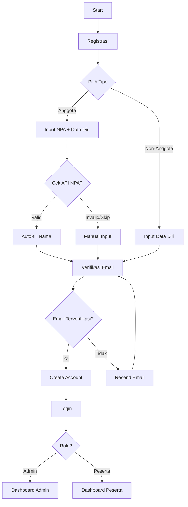
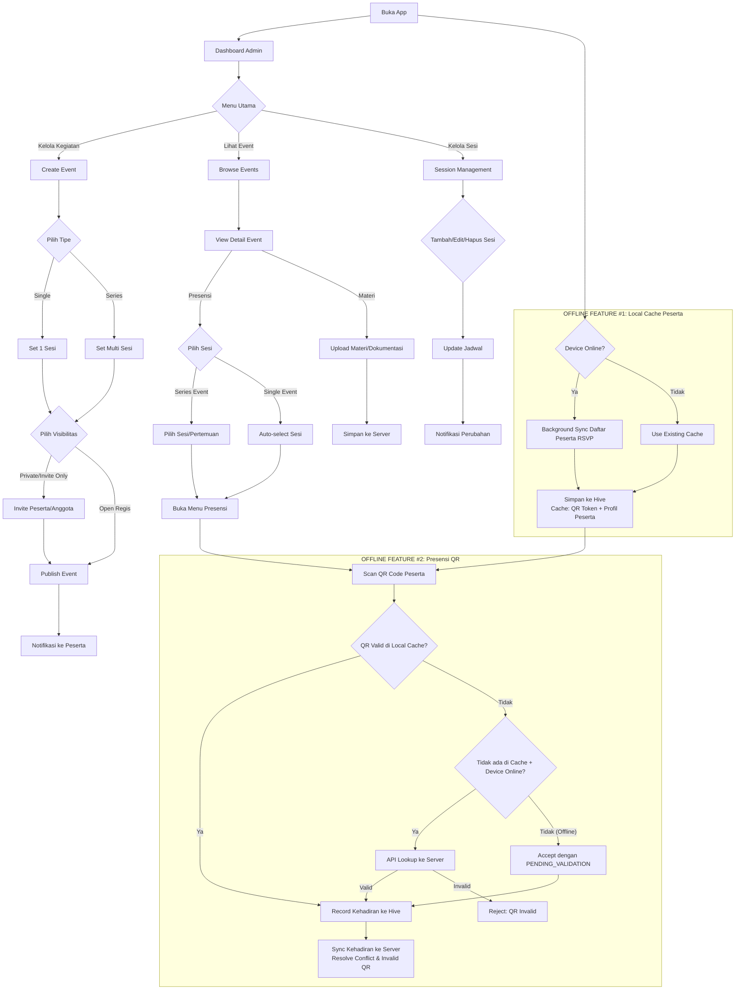
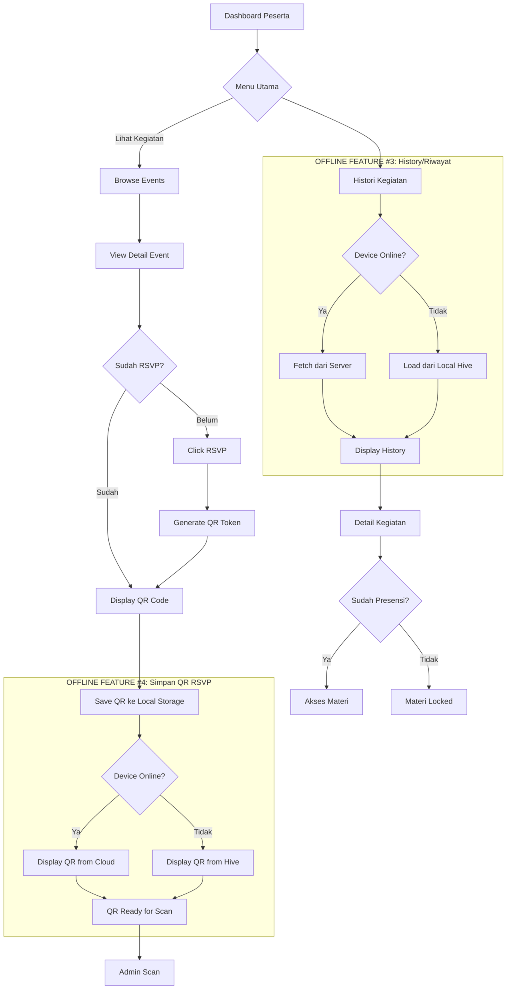
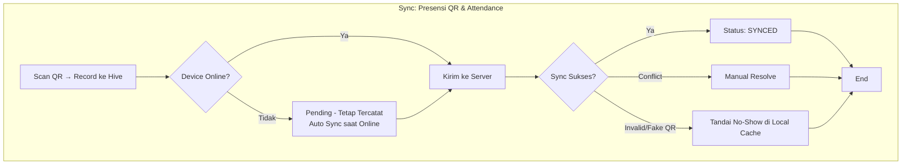
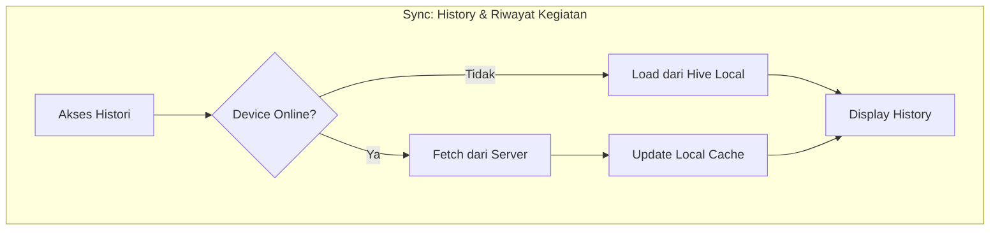
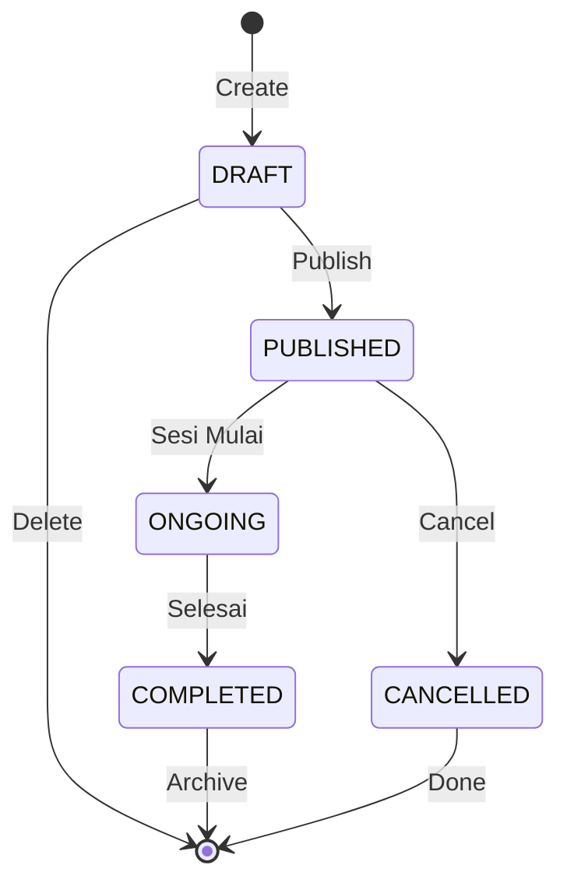

## Flowchart - Aplikasi Manajemen Kegiatan PD Pemuda Persis

### 1. Alur Umum Registrasi & Login

---

### 2. Alur Admin (Pengurus)

---

### 3. Alur Peserta (Anggota/Non-Anggota)

---

### 4. Alur Sinkronisasi Data (Offline-First)

**Empat Penerapan Offline:**

1. **Local Cache Peserta** - Admin sync daftar peserta RSVP untuk validasi scan offline
2. **Presensi QR** - Kehadiran tercatat lokal dulu, sync saat online
3. **History/Riwayat** - Data riwayat tersimpan lokal, bisa diakses tanpa internet
4. **Simpan QR RSVP** - QR disimpan di device peserta, bisa ditunjukkan tanpa internet

---

### 5. State Event Lifecycle

---

### Catatan untuk Review

#### Asumsi Sistem (Berdasarkan Transkrip):
1. **Verifikasi Email:** Wajib untuk semua user (anggota & non-anggota)
2. **NPA:** Opsional untuk anggota (bisa diisi atau tidak)
3. **Offline-First (4 Fitur):** 
   - **Local Cache Peserta** - Admin sync daftar peserta RSVP saat **buka app** (background, jika online). Admin **browse event** → view detail → **pilih sesi** (khusus Series) → presensi. Jika QR tidak di cache saat scan, gunakan **deferred validation** (accept pending, validasi ulang saat sync)
   - **Presensi QR** - Data kehadiran tersimpan lokal, sync saat online. Resolusi konflik: valid/duplicate/invalid (auto no-show)
   - **History/Riwayat** - Data riwayat tersimpan lokal, bisa diakses tanpa internet
   - **Simpan QR RSVP** - QR tersimpan di device peserta, bisa ditunjukkan tanpa internet
4. **Validasi NPA (Opsional):** Saat registrasi anggota, sistem bisa cek API NPA untuk auto-fill nama (fitur nice-to-have)

#### Core Features:
- **Admin:** Kelola kegiatan, sesi, **presensi QR (offline)**, upload materi
- **Peserta:** RSVP, **check-in QR (offline)**, akses materi pasca-kegiatan, **lihat history (offline)**
- **Sync:** Otomatis sync untuk attendance dan history saat device online
- **Deferred Validation:** Kehadiran bisa tercatat meski QR belum di cache, akan divalidasi ulang saat sync
