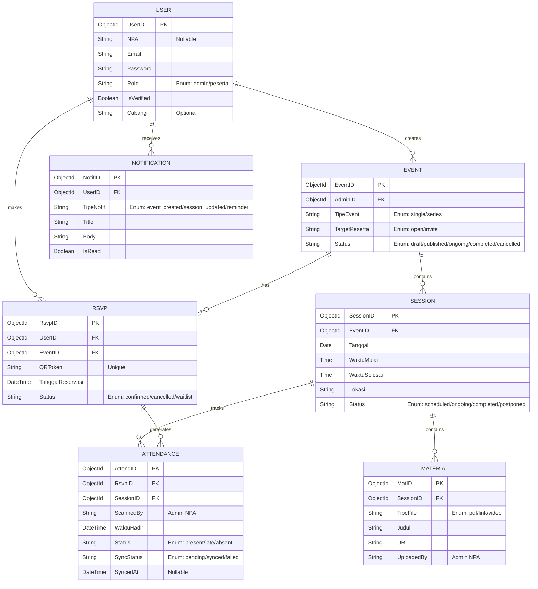
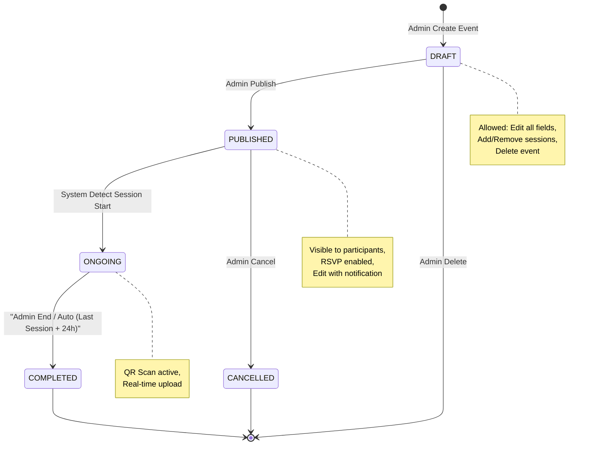
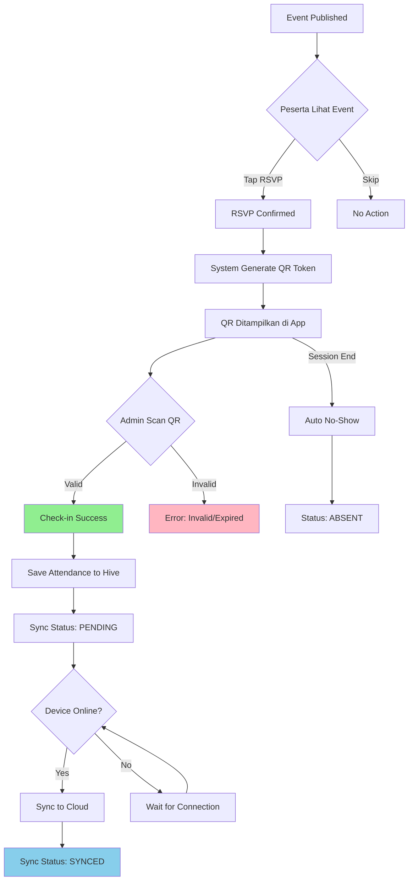
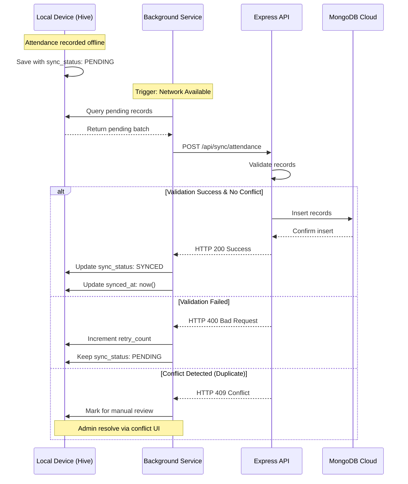

# **APLIKASI MANAJEMEN KEGIATAN PIMPINAN DAERAH PEMUDA PERSIS KABUPATEN BANDUNG**

**Anggota Kelompok :**

| Nama                   | NIM         |
| ---------------------- | ----------- |
| Fairuz Sheva Muhammad  | (241511073) |
| Fatimah Hawwa Alkhansa | (241511074) |
| Ikhsan Satriadi        | (241511080) |
| Qlio Amanda Febriany   | (241511087) |

PROGRAM STUDI D3 TEKNIK INFORMATIKA  
JURUSAN TEKNIK KOMPUTER DAN INFORMATIKA  
POLITEKNIK NEGERI BANDUNG  
2026  

## Judul Sistem

Aplikasi Manajemen Kegiatan Pimpinan Daerah Pemuda Persis.

## Deskripsi Masalah

### 2.1 Identifikasi Pengguna

Sistem ini melibatkan dua aktor utama dengan wewenang berbeda:

| Aktor                | Peran            | Wewenang Utama                                                                 |
| -------------------- | ---------------- | ------------------------------------------------------------------------------ |
| **Admin (Pengurus)** | Manajer Kegiatan | CRUD kegiatan, atur sesi rutin, scan QR absensi, upload materi dan dokumentasi |
| **Peserta**          | Partisipan       | RSVP, check-in QR, akses materi, lihat histori pribadi                         |

**Tipe Peserta:**
- **Anggota:** Memiliki NPA (Nomor Pokok Anggota), bisa mengisi cabang/unit organisasi
- **Non-Anggota:** Tidak memiliki NPA, wajib verifikasi email saat registrasi

**Karakteristik Pengguna:**
- Admin: 5-10 pengurus aktif, familiar dengan operasional organisasi, akses internet stabil di kantor sekretariat
- Peserta: 50-200+ user, variasi literacy teknologi, sering di lokasi dengan konektivitas terbatas (masjid, pesantren)
- **Cakupan:** Multi-daerah/cabang (dapat digunakan di berbagai jenjang organisasi Pemuda Persis)

### 2.2 Analisis Masalah

Berdasarkan observasi pada operasional PD Pemuda Persis Kabupaten Bandung, ditemukan beberapa kendala utama:

* **Keterbatasan Infrastruktur Jaringan (*Blank Spot*):** Kegiatan sering dilaksanakan di lokasi dengan penetrasi sinyal internet yang rendah, seperti ruang bawah tanah masjid atau gedung pesantren. Hal ini menyebabkan kegagalan sistem presensi berbasis *web* konvensional.
* **Inkonsistensi Pendataan Kegiatan Rutin:** Pengelolaan kegiatan berseri (seperti kajian kitab) masih dilakukan secara manual. Akibatnya, rekam jejak kehadiran anggota sulit dipantau secara berkesinambungan dan rawan terjadi kesalahan input data.
* **Pengarsipan Materi yang Tidak Terpusat:** Distribusi materi kajian melalui media sosial atau aplikasi pesan instan menyebabkan data mudah tertimbun, hilang, dan sulit diakses kembali oleh anggota untuk kebutuhan referensi di masa depan.
* **Lambatnya Pelaporan Data:** Ketiadaan basis data terpusat mengakibatkan pimpinan organisasi tidak dapat memantau tingkat keaktifan anggota dan efektivitas kegiatan secara *real-time*.

Pengembangan aplikasi mobile berbasis *Offline-First* diperlukan untuk menyediakan solusi teknis sebagai berikut:

* **Stabilitas Operasional di Lokasi Minim Sinyal:** Penggunaan database lokal (**Hive**) menjamin proses presensi tetap berjalan tanpa dependensi internet. Data akan disinkronkan secara otomatis ke **Cloud MongoDB** setelah perangkat terhubung kembali ke jaringan.
* **Sentralisasi Rekam Jejak Keanggotaan:** Sistem menyediakan portofolio digital bagi setiap anggota, sehingga histori keikutsertaan dalam berbagai jenjang kegiatan terdokumentasi dengan akurat dan transparan.
* **Efisiensi Administrasi dan Distribusi Konten:** Digitalisasi alur kerja mengurangi penggunaan kertas (*paperless*) dan menyediakan wadah terintegrasi untuk pendistribusian materi kajian secara sistematis per sesi kegiatan.
* **Validasi Keamanan Data:** Registrasi dengan NPA (opsional) untuk anggota organisasi, dengan validasi email wajib untuk non-anggota.

### 2.3 Justifikasi Kebutuhan Aplikasi Digital

**Kenapa harus mobile app (bukan web app)?**
1. **Mobilitas:** Admin perlu scan QR di lokasi kegiatan tanpa membawa laptop
2. **Offline capability:** Web app tidak bisa operasi tanpa internet; mobile app dengan Hive bisa
3. **Push notification:** Reminder otomatis ke peserta lebih efektif via mobile

**Kenapa butuh Offline-First Architecture?**
Tanpa offline-first, aplikasi menjadi tidak fungsional di lokasi blank spot—padahal justru di sinilah presensi paling kritis. Arsitektur offline-first memastikan:
- Data tersimpan lokal dulu (Hive), sync ke cloud (MongoDB) saat online
- Zero data loss meski device offline selama beberapa hari
- UX seamless: user tidak pernah melihat loading spinner akibat network timeout

## Daftar Role

### 3.1 Admin (Pengurus)

**Hak Akses:**
| Fitur                  | Aksi yang Diizinkan                                                                     |
| ---------------------- | --------------------------------------------------------------------------------------- |
| **Manajemen Kegiatan** | Buat/edit/hapus event (Single/Routine), atur target peserta (Open/Invite)               |
| **Session Management** | Tambah/update jadwal sesi rutin, tentukan lokasi per sesi                               |
| **Presensi Digital**   | Browse events, pilih View Detail, Scan QR Code peserta, lihat real-time attendance rate |
| **Konten Digital**     | Upload materi (PDF/Link), unggah dokumentasi foto, upload notulensi/evaluasi            |
| **Notifikasi**         | Push manual reminder ke peserta tertentu atau broadcast ke semua                        |

**Batasan:** Tidak bisa mengubah data kehadiran yang sudah tercatat (immutability untuk audit trail)

### 3.2 Peserta (Anggota & Non-Anggota)

**Hak Akses:**
| Fitur               | Aksi yang Diizinkan                                                                    |
| ------------------- | -------------------------------------------------------------------------------------- |
| **Reservasi**       | RSVP kegiatan (one-click untuk Single Event, one-time RSVP untuk seluruh Series Event) |
| **Presensi**        | Generate QR Code pribadi, tunjukkan ke Admin saat check-in                             |
| **Akses Materi**    | Download materi per sesi, lihat rundown acara                                          |
| **Histori Pribadi** | Lihat portfolio kegiatan yang pernah diikuti, statistik keaktifan pribadi              |

**Perbedaan Anggota vs Non-Anggota:**
| Aspek              | Anggota                    | Non-Anggota                                |
| ------------------ | -------------------------- | ------------------------------------------ |
| **Registrasi**     | NPA (opsional) + data diri | Email wajib verifikasi                     |
| **Field Profil**   | Bisa isi cabang/unit       | Tidak ada field cabang                     |
| **Akses Kegiatan** | Semua kegiatan             | Semua kegiatan (tergantung target peserta) |
| **Histori**        | Tercatat lengkap           | Tercatat lengkap                           |

**Batasan:** Tidak bisa lihat data kehadiran peserta lain, tidak bisa akses materi event yang tidak di-RSVP

## Use Case Utama (Brief Format)

### UC-01: Create Event

**Primary Actor:** Admin (Pengurus)

**Stakeholders and Interests:**
- **Admin:** Ingin membuat dan mengelola kegiatan dengan mudah, dapat mengatur jadwal dan materi
- **Peserta:** Ingin menerima informasi kegiatan yang jelas dan terstruktur
- **Organisasi:** Ingin tercatatnya semua kegiatan untuk laporan dan evaluasi

**Brief Description:** Admin membuat postingan kegiatan baru dengan dua mode: Single Event (sekali jalan) atau Series Event (multi-sesi rutin). Admin dapat mengatur visibilitas event (Open Registration atau Private/Invite Only), jadwal sesi, dan mengunggah materi awal.

**Preconditions:**
- Admin telah terautentikasi dan memiliki role admin

**Postconditions:**
- Event tersimpan di database (MongoDB dan Hive local cache)
- Notifikasi push terkirim ke peserta target (jika target = open)

**Main Success Scenario:**
1. Admin memilih menu "Buat Kegiatan"
2. Admin mengisi detail kegiatan: judul, deskripsi, tipe (Single/Series)
3. Admin memilih visibilitas: Open Registration atau Private/Invite Only
4. Jika Private/Invite Only: Admin invite peserta/anggota tertentu
5. Jika Series: Admin menentukan jumlah sesi awal dan jadwal per sesi
6. Admin mengunggah materi awal (opsional)
7. Admin men-submit form (Publish Event)
8. Sistem memvalidasi data dan menyimpan ke MongoDB + Hive
9. Sistem mengirim push notification ke peserta (jika Open Registration) atau peserta yang di-invite

---

### UC-02: RSVP Event

**Primary Actor:** Peserta (Anggota/Non-Anggota)

**Stakeholders and Interests:**
- **Peserta:** Ingin mendaftar kegiatan yang diminati, mendapatkan QR Code untuk check-in
- **Admin:** Ingin mengetahui jumlah peserta yang akan hadir untuk persiapan logistik
- **Organisasi:** Ingin data kehadiran tercatat dengan baik

**Brief Description:** Peserta mendaftarkan diri untuk mengikuti kegiatan melalui aplikasi. Sistem menghasilkan QR Code unik per RSVP yang digunakan untuk proses check-in di lokasi.

**Preconditions:**
- Peserta telah terautentikasi
- Event masih dalam status open registration
- Kuota peserta masih tersedia (jika ada limit)

**Postconditions:**
- RSVP tersimpan dengan status 'confirmed'
- QR Token unik di-generate dan ditampilkan
- Slot peserta terisi (jika ada limit)

**Main Success Scenario:**
1. Peserta melihat list event di dashboard
2. Peserta memilih event dan melihat detail (rundown, materi, lokasi)
3. Peserta men-tap tombol "RSVP"
4. Sistem menampilkan konfirmasi
5. Peserta mengkonfirmasi RSVP
6. Sistem meng-generate QR Code unik untuk peserta di event tersebut
7. Sistem menyimpan RSVP ke Hive (local) kemudian sync ke cloud

---

### UC-03: Offline QR Check-in

**Primary Actor:** Admin (Scanner)

**Secondary Actor:** Peserta (Menunjukkan QR)

**Stakeholders and Interests:**
- **Admin:** Ingin mencatat kehadiran peserta dengan cepat, meski di lokasi tanpa internet
- **Peserta:** Ingin ter-catat hadir tanpa perlu antre panjang
- **Organisasi:** Ingin data kehadiran akurat untuk evaluasi dan laporan

**Brief Description:** Admin memindai QR Code peserta di lokasi kegiatan untuk mencatat kehadiran. Proses validasi menggunakan local cache (Hive). Jika QR tidak ada di cache namun device online, dilakukan API lookup ke server. Jika device offline, QR tetap diterima dengan status PENDING_VALIDATION dan divalidasi ulang saat sync.

**Preconditions:**
- Peserta sudah RSVP dan memiliki QR Code yang valid
- QR Code tersimpan di device peserta (bisa ditampilkan tanpa internet)
- Admin sudah melakukan background sync saat buka aplikasi (jika online)

**Postconditions:**
- Kehadiran tercatat di local database (Hive) dengan status 'present'
- Sync_Status di-set ke 'pending' (menunggu sync ke cloud)
- Jika deferred validation: status 'pending_validation' sampai sync berhasil validasi

**Main Success Scenario:**
1. Admin browse event dari cache lokal, pilih View Detail Event
2. Admin tap "Presensi" untuk membuka menu Scan QR
3. Admin mengarahkan kamera ke QR Code peserta
4. Sistem memvalidasi QR terhadap local cache (Hive)
5. Sistem menampilkan "Check-in Sukses" dengan data peserta
6. Sistem menyimpan attendance record ke Hive dengan flag sync_status: 'pending'
7. Timestamp dicatat sebagai local_timestamp

**Extensions:**
- *4a. QR tidak ada di local cache + Device Online:* Sistem melakukan API Lookup ke Server. Jika valid, lanjut step 5. Jika invalid, tampil error.
- *4b. QR tidak ada di local cache + Device Offline:* Sistem menerima dengan PENDING_VALIDATION, lanjut step 5-6. Saat sync, server validasi ulang.
- *4c. QR Code expired atau sudah pernah scan:* Sistem menampilkan pesan error, proses check-in gagal

---

### UC-04: Session Management

**Primary Actor:** Admin

**Stakeholders and Interests:**
- **Admin:** Ingin mengelola jadwal dinamis untuk kegiatan rutin, bisa menambah/mengubah sesi
- **Peserta:** Ingin mendapat informasi jadwal terbaru jika ada perubahan
- **Organisasi:** Ingin fleksibilitas pengelolaan kegiatan berseri

**Brief Description:** Admin mengelola jadwal dinamis untuk kegiatan rutin (Series Event), termasuk menambah sesi baru, mengedit jadwal/waktu/lokasi, atau menghapus sesi yang belum dilaksanakan.

**Preconditions:**
- Series Event sudah dibuat dan dalam status published/ongoing

**Postconditions:**
- Jadwal sesi terupdate di database
- Notifikasi push terkirim ke semua peserta RSVP (jika ada perubahan)

**Main Success Scenario:**
1. Admin membuka detail Series Event
2. Admin memilih menu "Kelola Sesi"
3. Admin melakukan aksi: tambah sesi baru / edit sesi existing / hapus sesi
4. Admin men-submit perubahan
5. Sistem memvalidasi (tidak bisa edit sesi yang sudah completed)
6. Sistem menyimpan perubahan ke database
7. Sistem mengirim notifikasi push ke peserta RSVP tentang perubahan jadwal

---

### UC-05: Digital Archive Access

**Primary Actor:** Peserta

**Stakeholders and Interests:**
- **Peserta:** Ingin mengakses materi dan dokumentasi kegiatan yang sudah diikuti untuk referensi
- **Admin:** Ingin peserta dapat mengakses materi dengan mudah
- **Organisasi:** Ingin materi tersimpan terpusat dan tidak hilang

**Brief Description:** Peserta mengakses materi kajian (PDF, link, video) dan dokumentasi foto kegiatan yang sudah diikuti. Akses dibuka setelah peserta melakukan check-in di sesi terkait.

**Preconditions:**
- Peserta sudah melakukan check-in (attendance tercatat) di sesi terkait

**Postconditions:**
- Peserta dapat melihat/download materi
- Metadata file tercatat di history akses (opsional)

**Main Success Scenario:**
1. Peserta membuka menu "Histori Giat"
2. Peserta memilih kegiatan dari daftar
3. Peserta melihat tab "Materi" dan "Dokumentasi"
4. Peserta memilih file yang ingin di-download/dilihat
5. Sistem mengambil data dari cloud (jika online) atau cache lokal (jika sudah pernah dibuka)
6. File ditampilkan atau di-download ke device

---

### UC-06: Sync Manager (Background)

**Primary Actor:** System (Background Service)

**Stakeholders and Interests:**
- **Admin:** Ingin data attendance tetap tersimpan meski offline, sync otomatis saat online
- **Peserta:** Ingin data pribadi (RSVP, histori) konsisten di semua device
- **Organisasi:** Ingin data terpusat di cloud untuk laporan

**Brief Description:** Sistem mengelola sinkronisasi data antara Hive (local database) dan MongoDB (cloud) secara otomatis. Sync terjadi saat device online atau berdasarkan interval tertentu.

**Preconditions:**
- Ada data dengan sync_status = 'pending' atau 'pending_validation' di Hive

**Postconditions:**
- Data tersinkronisasi ke cloud (sync_status = 'synced')
- Atau conflict terdeteksi dan di-mark untuk manual resolve
- Atau deferred validation berhasil (QR valid) atau gagal (QR invalid → auto no-show)

**Main Success Scenario:**
1. Device mendeteksi koneksi internet tersedia (atau interval trigger)
2. Background Service mengecek tabel pending_sync di Hive
3. Service mengirim batch data dengan sync_status: 'pending' ke Express API
4. API memvalidasi dan menyimpan ke MongoDB
5. API mengembalikan konfirmasi sukses
6. Service mengupdate sync_status di Hive menjadi 'synced'

**Extensions:**
- *4a. Conflict detected (duplicate record):* API return 409 Conflict, data di-mark untuk manual review oleh admin
- *4b. Validation failed:* Data tetap pending, retry_count di-increment
- *4c. Deferred validation record:* API cek kevalidan QR yang diterima saat offline. Jika valid → sync_status 'synced'. Jika invalid → status 'absent' (auto no-show)

---

### UC-07: Account Registration

**Primary Actor:** Peserta (Calon User)

**Stakeholders and Interests:**
- **Calon User:** Ingin mendaftar akun dengan mudah, bisa sebagai anggota (dengan NPA) atau non-anggota
- **Organisasi:** Ingin membedakan anggota resmi vs non-anggota, memastikan email valid

**Brief Description:** Calon pengguna melakukan registrasi akun. Anggota organisasi dapat memasukkan NPA (opsional) untuk identifikasi, sedangkan non-anggota wajib melakukan verifikasi email.

**Preconditions:**
- Email belum terdaftar di sistem

**Postconditions:**
- Akun user tercipta dengan role 'peserta'
- Status verifikasi sesuai tipe: anggota (NPA tersimpan) atau non-anggota (email terverifikasi)

**Main Success Scenario (Anggota):**
1. User memilih "Register sebagai Anggota"
2. User memasukkan NPA (opsional) dan data diri (nama, email, password)
3. Jika NPA diisi: sistem mengecek validitas NPA ke API (nice-to-have)
4. Sistem mengirim email konfirmasi (opsional untuk anggota)
5. User mengkonfirmasi email (jika wajib diatur)
6. Akun aktif dengan status anggota

**Main Success Scenario (Non-Anggota):**
1. User memilih "Register sebagai Non-Anggota"
2. User memasukkan data diri (nama, email, password)
3. Sistem mengirim email verifikasi
4. User mengkonfirmasi email melalui link
5. Akun aktif dengan status non-anggota

## Daftar Entitas (Entity Relationship Diagram Konseptual)

### 5.1 Entity Relationship Diagram

### 5.2 Deskripsi Entitas dan Relasi

| Entitas          | Deskripsi                                                                                                                      | Atribut Kunci                                     |
| ---------------- | ------------------------------------------------------------------------------------------------------------------------------ | ------------------------------------------------- |
| **User**         | Pengguna aplikasi (Admin atau Peserta). Peserta terbagi Anggota (dengan NPA opsional) dan Non-Anggota (email verifikasi wajib) | UserID, NPA (nullable), Email, Role, Cabang (opt) |
| **Event**        | Kegiatan yang bisa Single (sekali) atau Series (rutin). Dibuat oleh Admin                                                      | EventID, TipeEvent, StatusEvent, TargetPeserta    |
| **Session**      | Sesi kegiatan untuk Series Event. Event Single tidak punya Session (1 Event = 1 Session implisit)                              | SessionID, Tanggal, Lokasi, StatusSesi            |
| **RSVP**         | Reservasi peserta untuk event. Generate QR Code unik per RSVP                                                                  | RsvpID, QRToken, StatusRSVP                       |
| **Attendance**   | Record kehadiran saat scan QR. **SyncStatus** untuk tracking offline-first                                                     | AttendID, WaktuHadir, StatusKehadiran, SyncStatus |
| **Material**     | Materi kajian (PDF/Link/Video) per session                                                                                     | MatID, TipeFile, URL                              |
| **Notification** | Push notification ke user                                                                                                      | NotifID, TipeNotif, IsRead                        |

### 5.3 Kardinalitas Relasi

| Relasi                | Kardinalitas | Keterangan                                                       |
| --------------------- | ------------ | ---------------------------------------------------------------- |
| User (Admin) → Event  | 1 : N        | 1 Admin bisa buat banyak Event                                   |
| Event → Session       | 1 : N        | 1 Series Event punya banyak Session (Single Event: N=0 implisit) |
| User (Peserta) → RSVP | 1 : N        | 1 Peserta bisa RSVP banyak Event                                 |
| Event → RSVP          | 1 : N        | 1 Event bisa punya banyak RSVP                                   |
| RSVP → Attendance     | 1 : N        | 1 RSVP (Series) bisa punya N Attendance per Session              |
| Session → Attendance  | 1 : N        | 1 Session punya banyak Attendance                                |
| Session → Material    | 1 : N        | 1 Session punya banyak Material                                  |
| User → Notification   | 1 : N        | 1 User terima banyak Notifikasi                                  |

## Skema Alur Workflow

### 6.1 Event Lifecycle State Diagram

| State     | Kondisi                                        | Aksi yang Boleh Dilakukan                                    | Trigger Transisi                                                     |
| --------- | ---------------------------------------------- | ------------------------------------------------------------ | -------------------------------------------------------------------- |
| DRAFT     | Event baru dibuat, belum publish               | Edit semua field, tambah/hapus sesi, delete event            | Admin tap "Publish"                                                  |
| PUBLISHED | Event terlihat di dashboard anggota, bisa RSVP | Edit jadwal (dengan notifikasi ke peserta), tambah sesi baru | Sistem deteksi waktu sesi pertama                                    |
| ONGOING   | Event sedang berlangsung                       | Scan QR check-in, upload dokumentasi real-time               | Admin tap "Selesai" atau sistem deteksi waktu sesi terakhir + 24 jam |
| COMPLETED | Semua sesi selesai                             | Upload evaluasi, lihat laporan kehadiran, tidak bisa edit    | -                                                                    |
| CANCELLED | Event dibatalkan                               | Notifikasi ke semua peserta, refund slot (jika ada)          | Admin tap "Batalkan"                                                 |

### 6.2 RSVP & Check-in Activity Diagram

| State        | Actor   | Aksi                         | Output                       | Data State                                                 |
| ------------ | ------- | ---------------------------- | ---------------------------- | ---------------------------------------------------------- |
| AVAILABLE    | System  | Event published              | Event muncul di list peserta | -                                                          |
| RSVP         | Peserta | Tap "RSVP"                   | QR Code generated            | `RSVP.status = 'confirmed'`                                |
| QR_GENERATED | System  | Generate unique token        | QR ditampilkan di app        | `QR_Code_Token` tersimpan                                  |
| CHECKED_IN   | Admin   | Scan QR valid                | Attendance record created    | `Attendance.status = 'present'`, `Sync_Status = 'pending'` |
| NO_SHOW      | System  | Sesi selesai, tidak check-in | Status = 'absent'            | Auto-set                                                   |

### 6.3 Offline Sync Sequence Diagram

**Proses Detail:**

1. **Local Record Creation:**
   - Attendance dicatat di Hive dengan flag `Sync_Status: 'pending'`
   - Timestamp dicatat sebagai `local_timestamp`

2. **Sync Trigger:**
   - Event: Device kembali online
   - Atau: Interval 15 menit (background service)
   - Atau: User manual tap "Sync Now"

3. **API Submit:**
   - Batch kirim semua records dengan `Sync_Status: 'pending'`
   - Endpoint: `POST /api/sync/attendance`
   - Payload: `[{RsvpID, SessionID, Waktu_Hadir, Scanned_By}]`

4. **Server Processing:**
   - Validasi: Apakah RSVP valid? Apakah session masih ongoing?
   - Cek conflict: Apakah sudah ada record dengan (RsvpID, SessionID) yang sama?
   - Jika no conflict: Insert ke MongoDB, return 200 OK
   - Jika conflict: Return 409 Conflict dengan data existing

5. **Client Update:**
   - Success (200): Update `Sync_Status: 'synced'`, `Synced_At: now()`
   - Failed: Tetap `Sync_Status: 'pending'`, increment retry_count
   - Conflict (409): Tampilkan dialog ke Admin untuk resolve (keep local / keep server)

## Penjelasan Relevansi Offline-First

### 7.1 Kenapa Perlu Offline-First?

**Konteks Operasional:**
PD Pemuda Persis Kabupaten Bandung mengadakan kegiatan di lokasi-lokasi dengan karakteristik:
- Ruang bawah tanah masjid (besar, tembok tebal, sinyal 0-1 bar)
- Pesantren di daerah pinggiran (sinyal 2G/EDGE tidak stabil)
- Gedung serbaguna dengan banyak peserta (network congestion saat semua scan QR bersamaan)

**Problem dengan Online-Only Architecture:**
| Scenario                      | Online-Only Behavior              | Impact                                                  |
| ----------------------------- | --------------------------------- | ------------------------------------------------------- |
| Presensi di lokasi blank spot | Loading spinner → Timeout → Error | Antrean panjang, anggota frustrasi, data tidak tercatat |
| Admin scan QR                 | HTTP request pending → Retry loop | Baterai device habis cepat, UX jelek                    |
| Cek histori kegiatan          | "No internet connection" screen   | Anggota tidak bisa lihat materi saat di lokasi          |

**Solusi Offline-First:**
Aplikasi berfungsi **100% normal** tanpa internet. Data tersimpan lokal (Hive). Sync terjadi di background saat opportunity ada.

### 7.2 Data Apa yang Disimpan Lokal?

**Tabel Hive (Local Database):**

| Tabel          | Data yang Disimpan                                       | Alasan                                              |
| -------------- | -------------------------------------------------------- | --------------------------------------------------- |
| `users`        | Profil user yang login, daftar anggota (cache)           | Agar bisa lihat profil dan scan QR tanpa internet   |
| `events`       | List event yang di-RSVP + detailnya                      | Agar bisa lihat rundown dan lokasi saat offline     |
| `sessions`     | Jadwal sesi per event                                    | Critical untuk Series Event                         |
| `rsvps`        | RSVP status user                                         | Agar QR Code bisa digenerate tanpa internet         |
| `attendances`  | Record kehadiran (pending + synced + pending_validation) | **Core offline functionality, deferred validation** |
| `materials`    | Metadata materi + file PDF (jika sudah download)         | Agar bisa akses materi saat offline                 |
| `pending_sync` | Queue data yang belum sync                               | Untuk background sync manager                       |

### 7.3 Kapan Dilakukan Sinkronisasi?

**Sync Triggers:**

| Trigger                 | Kondisi                            | Prioritas Data                                    |
| ----------------------- | ---------------------------------- | ------------------------------------------------- |
| **Network Available**   | Device connect ke WiFi/Mobile Data | High: Attendance, Medium: RSVP, Low: Event update |
| **App Foreground**      | User buka aplikasi                 | Sync check (fast, < 2 detik)                      |
| **Manual Sync**         | User tap "Sync Now"                | All pending data                                  |
| **Background Interval** | Setiap 15 menit (jika ada pending) | Batch sync                                        |

**Conflict Resolution:**
- **Scenario A (Duplicate):** Admin scan QR saat offline. Ternyata peserta sudah tercatat hadir oleh admin lain (device lain yang online). **Strategy:** Last-write-wins atau manual review.
- **Scenario B (Deferred Validation):** Admin terima QR saat offline (tidak di cache). Saat sync, server cek kevalidan. **Strategy:** Jika valid → sync sukses. Jika invalid → auto no-show.

**Note:** Server disediakan oleh pihak mitra. Backend menggunakan arsitektur API + Database (MongoDB), dengan database lokal (Hive) sebagai cache dan offline storage.

### 7.4 Perbandingan dengan Solusi Konvensional

| Aspek                    | Web App (Online)   | Mobile App Online-Only | Mobile App Offline-First (Aplikasi Ini) |
| ------------------------ | ------------------ | ---------------------- | --------------------------------------- |
| **Fungsi di blank spot** | Tidak bisa         | Tidak bisa             | Bisa 100%                               |
| **Baterai consumption**  | N/A                | Tinggi (retry network) | Rendah (lokal access)                   |
| **UX saat poor network** | Broken             | Loading spinner        | Seamless (user tidak sadar)             |
| **Data reliability**     | Tergantung network | Tergantung network     | Guaranteed (local first)                |
| **Complexity dev**       | Rendah             | Rendah                 | Tinggi (worth it untuk use case ini)    |
